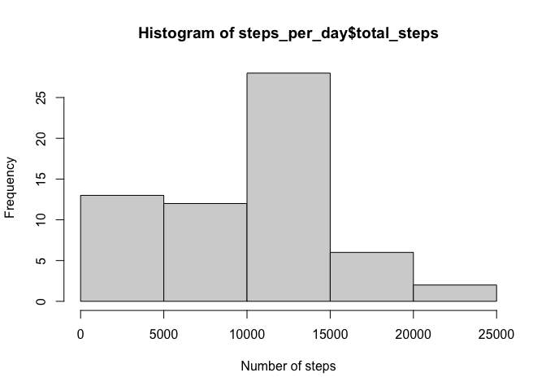
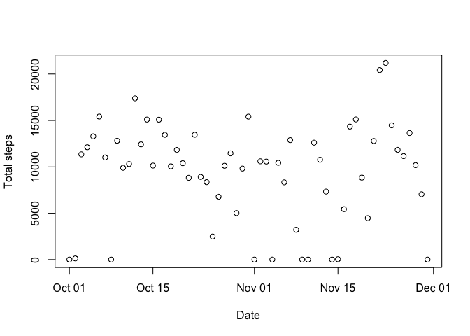
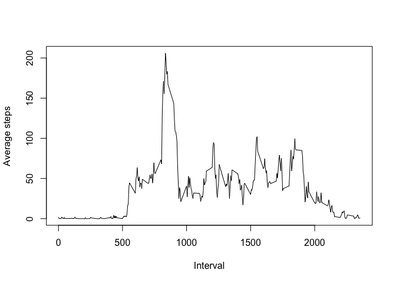
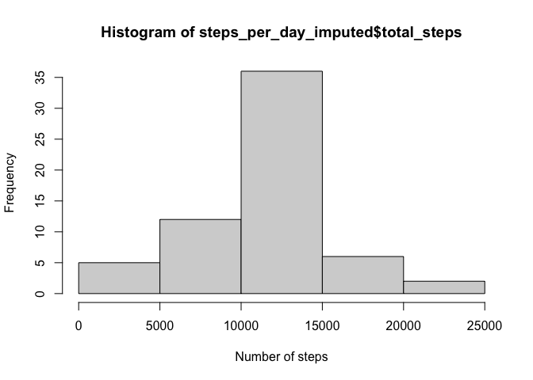
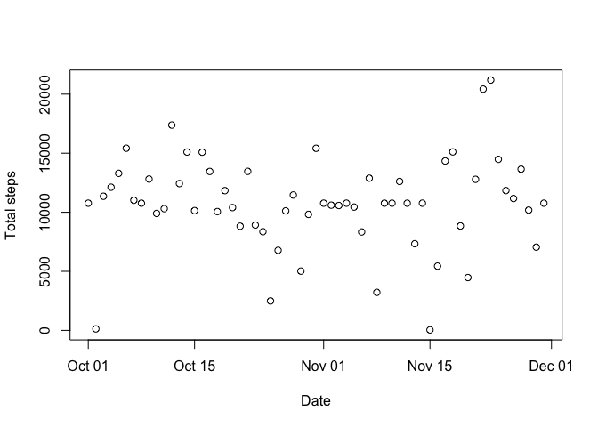
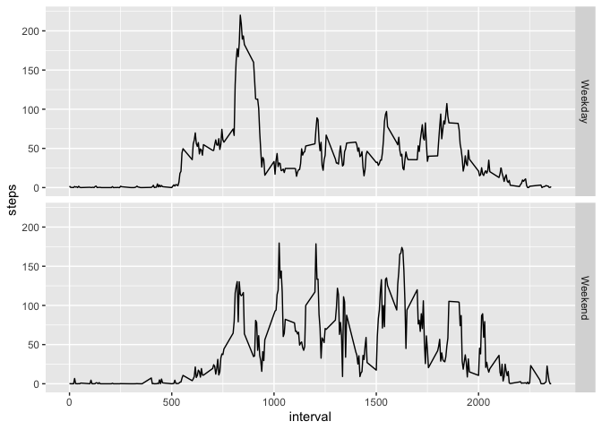

## Loading and preprocessing the data
In this section we'll first load the data we wil use.


``` r
input_data = read.csv('./activity.csv')
input_data$date = as.Date(input_data$date)
str(input_data)
```

```
## 'data.frame':	17568 obs. of  3 variables:
##  $ steps   : int  NA NA NA NA NA NA NA NA NA NA ...
##  $ date    : Date, format: "2012-10-01" "2012-10-01" ...
##  $ interval: int  0 5 10 15 20 25 30 35 40 45 ...
```

``` r
head(input_data)
```

```
##   steps       date interval
## 1    NA 2012-10-01        0
## 2    NA 2012-10-01        5
## 3    NA 2012-10-01       10
## 4    NA 2012-10-01       15
## 5    NA 2012-10-01       20
## 6    NA 2012-10-01       25
```

## What is mean total number of steps taken per day?

``` r
steps_per_day = input_data %>% group_by(date) %>% summarise(total_steps = sum(steps, na.rm=TRUE)) 
mean_steps = mean(steps_per_day$total_steps)
median_steps = median(steps_per_day$total_steps)
```
The mean total number of steps excluding the null values is 9354.2295082  and the median is 10395.

The distribution for the total number of steps is as follows:

``` r
hist(steps_per_day$total_steps, xlab='Number of steps', ylab='Frequency')
```

<!-- -->

Also the total number of steps across all the sample can be seen here:

``` r
plot(steps_per_day$date, steps_per_day$total_steps, xlim = c(min(steps_per_day$date), max(steps_per_day$date)), xlab='Date', ylab='Total steps')
```

<!-- -->

## What is the average daily activity pattern?
In this section, we're looking at the aveage behavior per interval during the day.


``` r
steps_per_hour = input_data %>% group_by(interval) %>% summarise(average_steps = mean(steps, na.rm=TRUE)) 
plot(steps_per_hour$interval, steps_per_hour$average_steps, type='l', xlim = c(min(steps_per_hour$interval), max(steps_per_hour$interval)), xlab='Interval', ylab='Average steps')
```

<!-- -->

## Imputing missing values

First, we need to identify the total number of missing values:

``` r
missing_steps = sum(is.na(input_data$steps))
missing_dates = sum(is.na(input_data$date))
missing_intervals = sum(is.na(input_data$interval))
```

We have 2304 missing steps, 0 missing dates and 0 missing intervals, so we will replace the missing values with the mean of the specified interval, for further analysis on the behaviors.


``` r
imputed_data = input_data

for(row in 1:dim(input_data)[1]) {
  if(is.na(imputed_data[row,1])) {
    imputed_data[row,1] = steps_per_hour[steps_per_hour$interval == imputed_data[row,3],2]
  }
}

head(imputed_data)
```

```
##       steps       date interval
## 1 1.7169811 2012-10-01        0
## 2 0.3396226 2012-10-01        5
## 3 0.1320755 2012-10-01       10
## 4 0.1509434 2012-10-01       15
## 5 0.0754717 2012-10-01       20
## 6 2.0943396 2012-10-01       25
```

So, once the NAs have been replace, we can see how the total steps per day will behave:


``` r
steps_per_day_imputed = imputed_data %>% group_by(date) %>% summarise(total_steps = sum(steps, na.rm=TRUE)) 
mean_steps = as.integer(mean(steps_per_day_imputed$total_steps))
median_steps = as.integer(median(steps_per_day_imputed$total_steps))
```

The mean total number of steps excluding the null values is 10766 now, and the median is 10766, and the distribution for the total number of steps is now as follows:


``` r
hist(steps_per_day_imputed$total_steps, xlab='Number of steps', ylab='Frequency')
```

<!-- -->

The visualization does change, specially on the days where we had very lo values.


``` r
plot(steps_per_day_imputed$date, steps_per_day_imputed$total_steps, xlim = c(min(steps_per_day_imputed$date), max(steps_per_day_imputed$date)), xlab='Date', ylab='Total steps')
```

<!-- -->

## Are there differences in activity patterns between weekdays and weekends?

We will use the imputed data to have a better base for summarization and analysis.  First, we need to identify if a given entry is a weekday or not, and then we can summarize accordingly:


``` r
is_weekday <- function(day_name) {
     if(day_name %in% c('Satuday','Sunday')) {
         return('Weekend')
     }
     else {
         return('Weekday')
     }
 }

imputed_data$day_name = weekdays(imputed_data$date)
imputed_data$is_weekday = as.factor(mapply(is_weekday, imputed_data$day_name))

head(imputed_data)
```

```
##       steps       date interval day_name is_weekday
## 1 1.7169811 2012-10-01        0   Monday    Weekday
## 2 0.3396226 2012-10-01        5   Monday    Weekday
## 3 0.1320755 2012-10-01       10   Monday    Weekday
## 4 0.1509434 2012-10-01       15   Monday    Weekday
## 5 0.0754717 2012-10-01       20   Monday    Weekday
## 6 2.0943396 2012-10-01       25   Monday    Weekday
```

``` r
str(imputed_data)
```

```
## 'data.frame':	17568 obs. of  5 variables:
##  $ steps     : num  1.717 0.3396 0.1321 0.1509 0.0755 ...
##  $ date      : Date, format: "2012-10-01" "2012-10-01" ...
##  $ interval  : int  0 5 10 15 20 25 30 35 40 45 ...
##  $ day_name  : chr  "Monday" "Monday" "Monday" "Monday" ...
##  $ is_weekday: Factor w/ 2 levels "Weekday","Weekend": 1 1 1 1 1 1 1 1 1 1 ...
```

Now that we have identified which days are weekdays or weekends, we can also summarize accordingly on the hour and the is_weekend flag.  As you can see on the charts, over the weekends, there tends to be more intensity in the activity data as it is more continuous and larger in general, except for a a large peak.


``` r
total_steps = aggregate(steps ~ interval + is_weekday, imputed_data, mean)
ggplot(total_steps, aes(x=interval, y=steps)) + geom_line() + facet_grid(is_weekday ~ .)
```

<!-- -->
